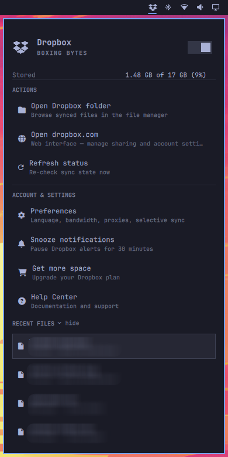

# Dropbox+ for Omarchy

A community plugin for the [Omarchy](https://omarchy.org) shell bar: real
Dropbox status, storage usage, quick actions, account menu entries, and a
collapsible recent-files list — all in one panel.



## Install

```bash
omarchy plugin add https://github.com/pablohc/omarchy-dropbox-plus.git --enable
```

Requires the Dropbox daemon (`dropboxd`) and the `dropbox-cli` helper installed
(Omarchy ships a Dropbox service in the service menu). Log in from the panel on
first use.

## Remove

```bash
omarchy plugin remove pablohc.dropbox
```

This unregisters the widget and deletes the plugin folder. Your Dropbox folder
and account are untouched.

## External dependencies

| Dependency | Used for |
| --- | --- |
| `dropboxd` | The Dropbox daemon itself (sync state, SNI menu) |
| `dropbox-cli` | Status, quota, recent files, share links, login |
| `python3` | Runs the status helper script (`status.py`) |
| `wl-copy` | Copy share links to the clipboard |
| `strata` | Open the Dropbox folder and recent files (Omarchy's default file manager) |

## What it shows

- **Hero** with a live sync-state phrase, pause/resume switch, and your storage
  usage (`Stored: 1.45 GB of 17 GB (9%)`).
- **Actions**: open the Dropbox folder, open dropbox.com, refresh status.
- **Account & settings**: Preferences, Snooze notifications, Get more space and
  Help Center fire dropboxd's own DBus menu entries — no extra tray icon needed.
- **Recent files**: the last synced files with relative timestamps, collapsible
  to save space. Click to open, right-click to copy a share link.

## Keyboard

Fully keyboard-centric: every row (switch, actions, account entries and
recent files) is reachable with the arrow keys.

| Key | Action |
| --- | --- |
| `↑` / `↓` | Move across the switch, Actions, Account and Recent files |
| `Enter` | Activate (toggle switch / run action / open file / log in) |
| `R` / `L` / `P` | Refresh status / login / pause-syncing |
| `Tab` | Cycle Omarchy panels |
| `Esc` | Close |

## Improvements over the built-in `omarchy.dropbox` plugin

This started as a fork of the stock Dropbox panel and grew:

- **Collapsible Recent Files section** — the stock panel always lists files;
  here the section collapses to a one-line header with an animated chevron.
- **Account entries that actually work** — Preferences / Snooze / Get more
  space / Help Center resolve the dropboxd SNI menu and fire its entries by
  label, with normalized matching (the daemon flips between `Preferences...`
  and `Preferences…`), retry while the DBus layout populates, and submenu
  traversal (Snooze fires "For the next 30 minutes" inside its submenu). The
  stock panel has no account section at all.
- **Stable, non-jumpy recent-files viewport** — shows exactly 4 full rows with
  an internal scroll for the rest. Hovering never scrolls the list under your
  pointer, and keyboard navigation only scrolls when a row is genuinely
  clipped (no ping-pong between first and last row).
- **Scale-safe row measurement** — the visible-rows window is measured from the
  live row height, so theme font scaling can't leave a half-cut row.
- **In-panel DBus menu reuse** — account actions reuse the daemon's SNI menu
  instead of spawning a second tray icon.
- **Right-click → copy share link** on any recent file.
- **Status line + efficient scans** — action feedback and errors surface in
  the panel; the recent-files scan uses scandir with cached stats and skips
  Dropbox's cache dir, so the periodic refresh stays cheap on large
  libraries.
- **Correct Nerd Font v3 glyphs** — the stock panel writes 5-digit codepoints
  as `\uF0450`, which JavaScript parses as `U+F045` plus a stray literal digit
  rendered over the icon (the Preferences row shows a "3" on it). This plugin
  uses `\u{F0450}` escapes so Refresh and Preferences render their real
  glyphs.

## Configuration

`Refresh interval (seconds)` in the plugin settings (10–3600, default 60).

## How it works

- `status.py` talks to `dropbox-cli` for status, quota and the recent-files
  list; `Service.qml` schedules it and exposes a small state API.
- `SniMenu.qml` resolves the Dropbox item in `Quickshell.Services.SystemTray`
  and triggers its DBus menu entries (Preferences, Snooze…).
- `Panel.qml` wires the bar button, IPC (`pablohc.dropbox` target: `open`,
  `toggle`, `refresh`, `login`, `status`, `menu` — the last one dumps the
  resolved DBus menu labels for debugging), keyboard navigation and layout;
  `RecentsSection.qml` owns the collapsible list.

## License

MIT — see [LICENSE](LICENSE). Fork of the MIT-licensed plugin shipped with
Omarchy (`omarchy.dropbox`).
